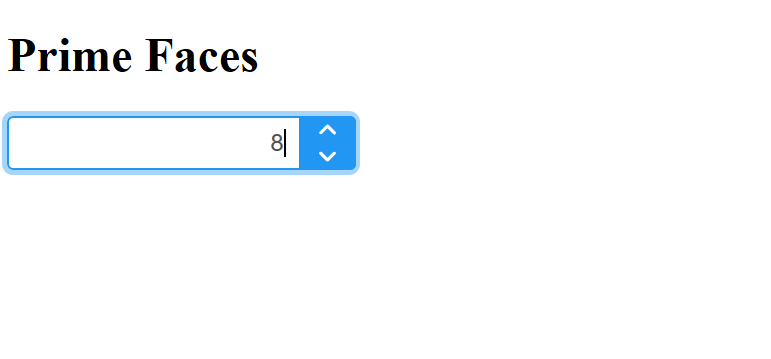

# PF - Intro Prime Faces

## Instalación

> `pom.xml`

```xml
<dependency>
    <groupId>org.primefaces</groupId>
    <artifactId>primefaces</artifactId>
    <version>12.0.0</version>
</dependency>
```

## Namespace

```text
    xmlns:p="http://primefaces.org/ui"
```

## Prueba

```xml
<p:spinner />
```



> **Código completo de la prueba**

```xml
<!DOCTYPE html PUBLIC "-//W3C//DTD XHTML 1.0 Transitional//EN" 
    "http://www.w3.org/TR/xhtml1/DTD/xhtml1-transitional.dtd">

<html xmlns="http://www.w3.org/1999/xhtml"
    xmlns:ui="http://xmlns.jcp.org/jsf/facelets"
    xmlns:h="http://xmlns.jcp.org/jsf/html"
    xmlns:f="http://xmlns.jcp.org/jsf/core"
    xmlns:p="http://primefaces.org/ui">

<h:head>
    <title>Prime Faces</title>
</h:head>

<h:body>
    
    <h1><h:outputText value="Prime Faces" /> </h1>
    
    <div>
        <p:spinner />
    </div>
    
</h:body>

</html>
```
